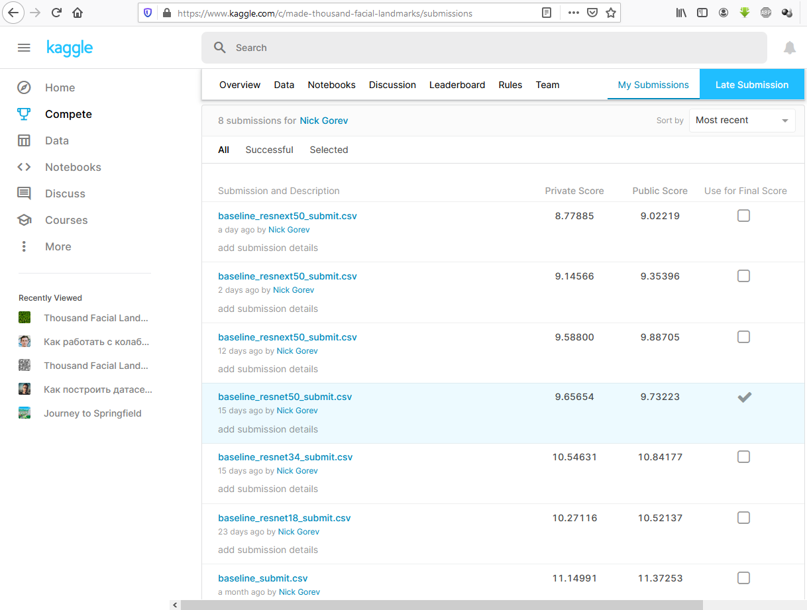

# дз № 1 по курсу компьютерное зрение

Решение выполнено в виде [ноутбука][made_CV_hw1_resnext50.ipynb], выполняемого в google colab.

Основные особенности:

1. За основу решения взят [бейзлайн][https://github.com/BorisLestsov/MADE/tree/master/contest1/unsupervised-landmarks-thousand-landmarks-contest]. Код из файлов [hack_utils.py][https://github.com/BorisLestsov/MADE/blob/master/contest1/unsupervised-landmarks-thousand-landmarks-contest/hack_utils.py] и [hack_train.py][https://github.com/BorisLestsov/MADE/blob/master/contest1/unsupervised-landmarks-thousand-landmarks-contest/hack_train.py] скопирован в ноутбук.

2. Данные в колаб загружаются с помощью датасета каггла в соответствии с [инструкциями][https://www.kaggle.com/c/made-thousand-facial-landmarks/discussion/143089]. Команды для загрузки данных скопированы из [https://colab.research.google.com/drive/1wb0E5i08yQym3SkSGuCCYr1LG2Ii1Rk3][https://colab.research.google.com/drive/1wb0E5i08yQym3SkSGuCCYr1LG2Ii1Rk3].

3. В качестве оптимизатора используется [RAdam optimizer][https://github.com/LiyuanLucasLiu/RAdam]

4. Исправлены параметры предобработки:
```{python}
    TransformByKeys(transforms.Normalize(mean=[0.485, 0.456, 0.406], 
                                         std=[0.229, 0.224, 0.225]), ("image",)),
```

5. За основу взята готовая предобученная модель [resnext50][https://pytorch.org/docs/stable/torchvision/models.html#id27]. Вместо трех последних слоев добавлены два полносвязных слоя с дропаутом. Активации - ReLU.
```{python}
num_ftrs = 65536
n_hidden = 4 * NUM_PTS

resnet = models.resnext50_32x4d(pretrained=True)

model = nn.Sequential(*[layer for layer in list(resnet.children())[:-3]], 
                      nn.ReLU(), nn.Flatten(), nn.Dropout(),
                      nn.Linear(num_ftrs, n_hidden, bias=True),
                      nn.ReLU(),  
                      nn.Linear(n_hidden, 2 * NUM_PTS, bias=True)
                     )
```

6. Из-за ограничений google colab пришлось запускать обучение три дня с сохранением промежуточных результатов на google диске. В ходе обучения удалось достичь loss = 1.5 на валидационной выборке. 


Скриншот со страницы с сабмитами в kaggle
